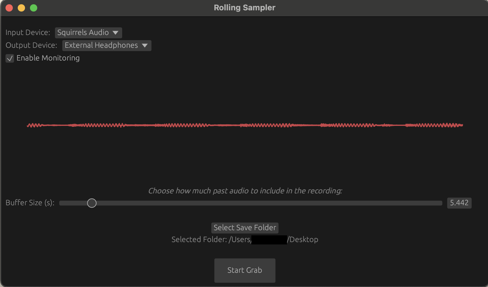

# Rolling Sampler

> **NOTE:** This was a beginner Rust learning project so expect some pretty terrible code (as well as unwise additions from our AI friend).

## Overview
Desktop application for sampling live audio, starting recording from a desired number of seconds in the past so you don't have to manually move back in the audio.



## Features
- Real-time Audio Visualisation: Displays a rolling waveform of audio input.
- Device Selection: Allows selection of available input audio devices.
- Adjustable Buffer Size: Users can choose how much past audio to include in the recording (in seconds).
- Save Recordings: Saves the recorded audio as a .wav file, including the option to select the save folder.
- Cross-platform: Built with cpal, eframe, and egui, making it compatible with multiple platforms (Linux, macOS, Windows).

## Prerequisites
Before running this application, ensure you have the following installed:
- Rust (latest stable version)

## Usage
1. Clone the repository:
```bash
git clone https://github.com/your-username/rolling-sampler.git
cd rolling-sampler
```
2. Build the project:
```bash
cargo build --release
```
3. Run the project:
```bash
cargo run
```
This will launch the GUI, where you can start interacting with the application.

## How to Use
1. Select Input Device: Use the dropdown menu to select your desired input device (e.g., microphone).
1. Select Output Device: if you want to do live monitoring you can select that here too.
2. Adjust Buffer Size: The slider allows you to change how much past audio is stored before saving (in seconds).
3. Start/Stop Recording: Click "Start Grab" to begin capturing audio. Click "Stop Grab" to stop and save the recording.
4. Select Save Folder: You can choose where the .wav files will be saved using the "Select Save Folder" button.

## Code Structure
- main.rs: Contains the core application logic, including real-time audio recording, waveform visualisation, and UI components.
    - Recorder: Manages audio input, buffer handling, and .wav file writing.
    - CircularBuffer: Circular buffer to store and manage audio samples, allowing both real-time visualisation and static mode for finalising recordings.

## Dependencies
The project relies on the following crates:
- cpal: For interacting with audio devices.
- eframe and egui: For building the graphical user interface.
- hound: To save recordings as .wav files.
- rfd: To open native file dialogs.
- chrono: For timestamp-based file names.
- dirs: For determining the default save path (Desktop).

## TODO
- ~Add output device choice for monitoring (kind of important 😅).~
- ~the input device that is routed to the output device should be the same as the input device selected~
- ~monitoring stereo output still doesn't work properly~
- the resampling for live monitoring doesn't seem to work
- Improve live monitoring audio quality - seems to pop a decent amount
- optimise and tidy code
- I tried to bundle it into a macos app but I couldn't get it to request the appropiate permissions

## License
This project is licensed under the MIT License - see the LICENSE file for details.

Feel free to contribute by submitting issues or pull requests!